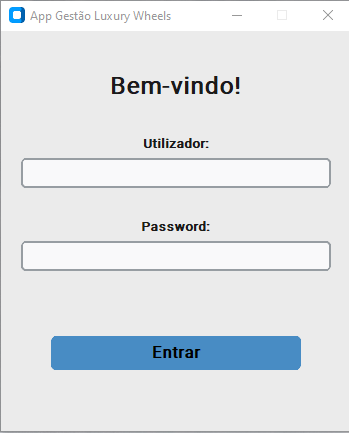
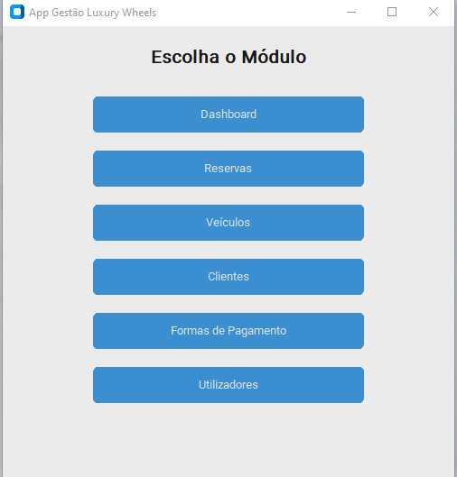
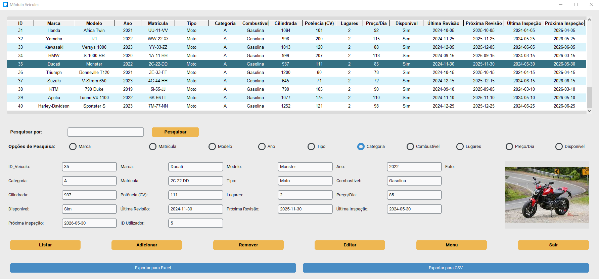
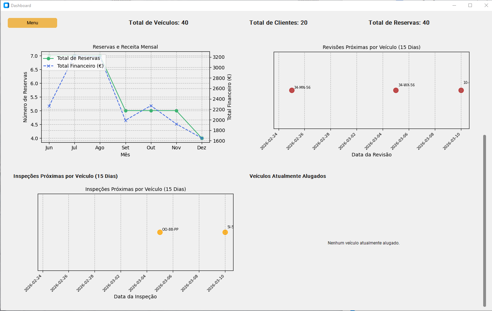

# 🚗 Luxury Wheels - Rent-a-Car Management System

**App Gestão Luxury Wheels** is a Python-based desktop management suite developed for a fictitious vehicle rental company. This project demonstrates modular application architecture, SQL persistence, and secure credential handling.

All data provided in the SQLite database and SQL scripts is **strictly fictitious**, generated for demonstration purposes only.

---

## 🌟 Key Features

* **Fleet & Maintenance:** Comprehensive vehicle lifecycle tracking, including maintenance scheduling and real-time status monitoring.
* **Business Operations:** Integrated management of clients, bookings, and payment workflows.
* **Analytics Dashboard:** Visual interface for operational metrics and financial performance tracking.
* **Security:** Decoupled credential management using environment variables (`os.getenv`).

---

## 📸 Interface Preview

| Login & Security | Main Menu |
| :--- | :--- |
|  |  |

| Vehicle Management | Interactive Dashboard |
| :--- | :--- |
|  |  |

---

## 🛠️ Tech Stack

* **Language:** Python 3.x
* **GUI Framework:** CustomTkinter (Modern UI)
* **Data Engine:** SQLite (Relational) & Pandas (Processing)
* **Architecture:** Modular Code Structure & Environment-based Configuration.

---

## 📁 Repository Structure

* `main.py` & `login.py`: Application entry point and authentication logic.
* `modulo_*.py`: Functional business modules.
* `/database`: SQL schema and initialization scripts.
* `/screenshots`: Full UI/UX documentation.

---

*Note: This project was developed as part of a professional Python Programming certification by Tokio School.
